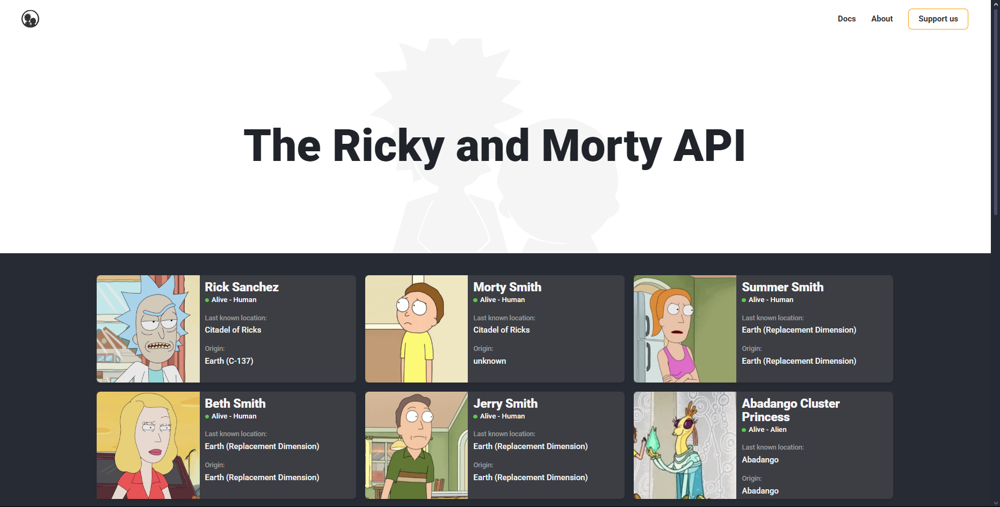

# Ricky & Morty API

Este é um projeto em React que consome a API da série Rick and Morty para exibir uma lista de personagens com paginação. O layout inclui seções visuais como cabeçalho, fundo temático e links sociais.
- Disponível em: https://rickyandmorty-api.netlify.app/

---




## 🚀 Tecnologias utilizadas

- React
- JavaScript 
- Styled-components 
- Fetch API
- Vite 

## 📦 Instalação

1. Clone o repositório e instale as dependências:
```bash
git clone https://github.com/seu-usuario/nome-do-projeto.git
cd ricky-morty-api
npm install
```

2. Inicie o servidor de desenvolvimento:
```
npm run dev
```
Abra http://localhost:3000 no seu navegador para ver a página inicial.


## 🌐 API utilizada
Os dados são obtidos da [Rick and Morty API](https://rickandmortyapi.com/), que fornece informações sobre os personagens, episódios e locais da série.

## ✨ Funcionalidades
- Listagem dos personagens de Rick and Morty
- Paginação entre páginas de resultados
- Layout dividido em seções reutilizáveis
- Estilização global com styled-components

## 📬 Contato
Caso tenha dúvidas ou sugestões, entre em contato:

Nome: Luisa Falqueto

E-mail: luisafzandonade@gmail.com

LinkedIn: [LinkedIn](https://www.linkedin.com/in/luisa-falqueto/)

GitHub: [GitHub](https://github.com/luisafalquetoz)

